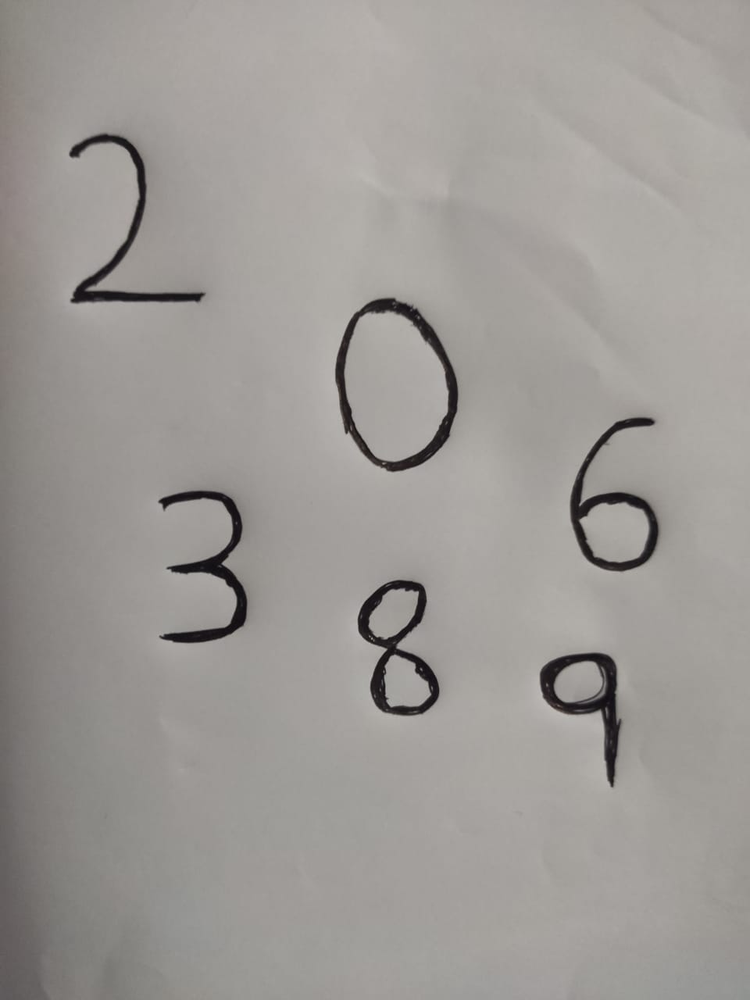
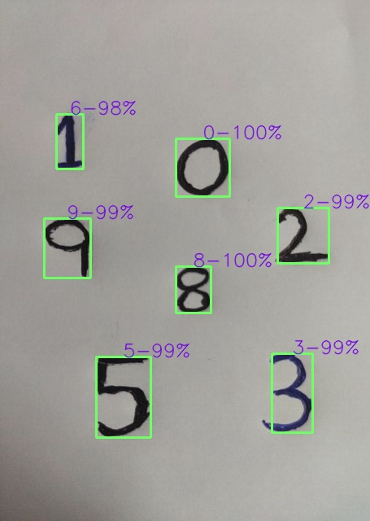

# Digits_Detection

Detecting digits in a **Video** feed using OpenCV and Tensorflow :wink:

## Modules

The two modules it contains are:

- [main_utils](https://github.com/vstark21/Digits_Detection/blob/master/main_utils.py) - This contains main functions 
- [model_utils](https://github.com/vstark21/Digits_Detection/blob/master/model_utils.py) - This contains functions to train a CNN model, using this CNN architecture I got an accuracy of **99.8%** in **Kaggle MNIST Competition :yum:** 

## What it does

<a href="https://github.com/vstark21/Digits_Detection/blob/master/images/test.jpeg"></a>
<a href="https://github.com/vstark21/Digits_Detection/blob/master/images/result.jpg"></a>


## Explanation

How it actually works is:
<br>

- Takes in video feed from mobile phone using some apps like [DroidCam](https://play.google.com/store/apps/details?id=com.dev47apps.droidcam&hl=en_IN), so we need to mention IP-address and port number which can be found in that app in **Python** as follows:
    ```python
    cap = cv2.VideoCapture("http://x.x.x.x:y/mjpegfeed")
    # where x -> IP-address and y -> port number

    ret, frame = cap.read()
    # frame -> one frame(picture) captured at that moment
    ```

- Then processes the image when key ***c*** is pressed to detect digits using contour detection!

- Then resizes the image and predicts using pre-trained model( <code>mnist_model.h5</code> ) if available or else trains a new model.

:copyright: <a href="https://github.com/vstark21"><small>V I S H W A S</small></a>
